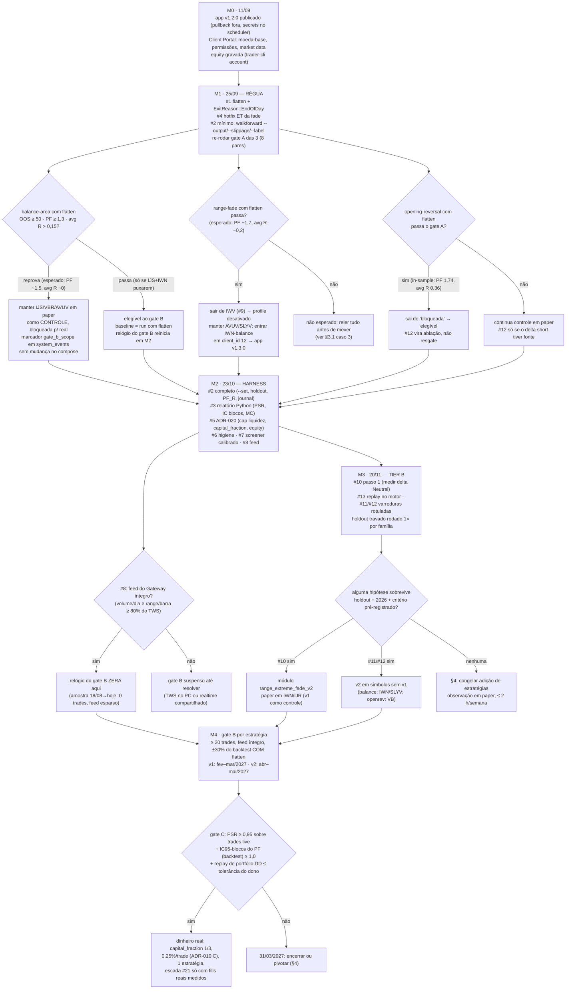

# Roadmap de decisão do dono — baseline de $, marcos, go/no-go e encerramento (07/09/2026)

**Por que existe:** o plano de lucratividade (`docs/cto-plano-lucratividade-2026-09.md`) e o
arquivo da pesquisa (`docs/reports/pesquisa-lucratividade-2026-09-07.md`) dizem *o que* fazer e
*em que ordem*, mas não respondem às perguntas que decidem alocação de tempo e capital: quanto
este portfólio rende hoje sob a régua certa, na conta que existe; quanto cada melhoria pode
acrescentar e com que probabilidade; o que fazer com as instâncias que reprovam; quando parar.
Este documento responde a isso com número, premissa e comando — e nada além disso.

**Lente:** gestor de portfólio decidindo onde gastar horas e (eventualmente) capital.
**Estado:** `main` em `d5e7279`; produção = app umbrelOS v1.1 com 8 instâncias em paper
(v1.2.0 do app **ainda não publicada**, HANDOFF 04/09); nada da Onda A implementado; hoje
(07/09) é feriado nos EUA — o próximo pregão é 08/09.
> ⚠️ **Estado em 07/09/2026, fim do dia.** O cabeçalho abaixo diz "nada da Onda A
> implementado". Isso valia de manhã. Depois disso foram implementados o
> ADR-018 (flatten), o hotfix ET da range-fade e o ADR-019 (harness) — `main` em
> `e1f1266`, **sem push**.
>
> O que muda para as contas desta página: o baseline de $ do §1 foi calculado
> por replay em Python sobre os JSONs do motor de 06/09, e o motor com o ADR-018
> agora **reproduz esses números** (contagem de trades idêntica; 20/9/8 saídas
> `end_of_day`, os mesmos trades overnight). Os cenários A–D seguem válidos.
>
> Duas coisas pioraram e não estão refletidas abaixo:
>
> - **O hotfix ET (item #4 desta página) corta ~21% do net in-sample da
>   range-fade** (PF 1,74 → 1,57), tudo em AVUV. O plano previa efeito
>   imensurável; não é. Todo cenário que inclua a fade fica abaixo do publicado.
> - **O PF em R põe a balance-area abaixo de 1** em AVUV (0,74) e VBR (0,97).
>   Isso não muda o P&L em dólares dos cenários, mas muda a probabilidade de
>   esses dólares se repetirem.
>
> Os marcos M0–M4 e os critérios de encerramento (18/12/2026 e 31/03/2027)
> continuam válidos e **não** foram recalculados. Detalhe em
> `docs/reports/gate-a-com-flatten-2026-09-07.md`.

**Regra de leitura:** todo número desta página é **paper**, em backtest **in-sample** com custo
de 2 bp/lado, e vem de um **replay em Python sobre os JSONs do motor de 06/09** (não do motor com
a ADR-018). Onde o número não existe, está a premissa e o comando que a substitui.

**Numeração dos itens (`#n`):** esta página foi escrita contra a versão da manhã de 07/09 do
ranking do plano-mestre; a tabela §4 do plano foi renumerada à tarde. Correspondência:
`#1` flatten = plano 1 · `#2` harness = 3 · `#3` relatório estatístico = 4 · `#4` hotfix ET = 5 ·
`#5` ADR-020 = 6 · `#6` higiene = 7 · `#7` screener = 8 · `#8` feed = **2** · `#9` sair de IWV = 9b ·
`#10` fade-v2 Neutral = 10 · `#11` balance-v2 = 11 · `#12` openrev short-only = **19 (Tier C —
hipótese de regime, sem implementação)** · `#13` replay de portfólio = 12 · `#14` expansão de
pares = 16 · `#15` instrumentação = 17 · `#16` STP LMT = 18 · `#19` timeframe 1h = 22 ·
`#21` escada de risco = 24. O item A9 (confirmação de ordem e short) é o 9 do plano e não aparece
aqui. Onde esta página trata `#12` como Tier B (§2, §3.3), vale o plano: é Onda C.

---

## 0. Resposta em uma página

| Pergunta do dono | Resposta curta | Onde |
|---|---|---|
| Quanto o portfólio atual rende por ano, na conta de 238k, sob a régua do live? | **US$ 27k/ano (+11%) no histórico inteiro; US$ 7,7k/ano (+3,2%) fora de jun–out/2025; US$ 13k/ano (+5,6%) só em 2026.** O IC95 anual em blocos **inclui zero** nos dois últimos cenários. | §1 |
| E se valer a regra de dinheiro real do ADR-017 (100% de notional)? | Cai ~15% na leitura do **live** (o teto de 100% só olha as posições já abertas, e na prática 2 posições cabem): US$ 22,7k / 6,3k / 12,3k por ano. Com a trava como o ADR-017 a **descreve** (teto incluindo a posição nova = 1 posição de cada vez, 48 trades recusados): US$ 13,5k / 2,4k / 10,4k por ano. Com `capital_fraction` 1/3: US$ 9k / 2,6k / 4,5k. | §1.2 |
| Quanto custa manter? | Dinheiro: ≈ CAD 5/mês (só energia; sem assinatura de dados, conta paper grátis). Tempo: **não documentado** — observado 5–10 h/semana em ago–set. | §1.4 |
| A balance-area reprova com flatten. E as 3 instâncias? | **Manter em paper como controle, bloqueada para dinheiro real** (custo zero, aporta amostra), sem mudar o compose. Sair de IWV (fade), entrar IWN (balance) num client_id novo. | §3, M1 |
| Quanto as melhorias de Tier B podem render? | Somando teto × probabilidade: **≈ US$ 8–11k/ano de valor esperado** para ~30 dias-pessoa — na mesma ordem de grandeza do baseline. Nenhuma tem probabilidade > 40%. | §2 |
| Quando dá para operar dinheiro real? | Não antes de **fev–mar/2027**: 20 trades por estratégia em paper levam 4–5,5 meses no ritmo medido (0,6 trade/pregão no portfólio); PSR ≥ 0,95 exige 43 trades (openrev) a 114 (fade). | §3, M4 |
| Quando parar? | **18/12/2026:** se nenhuma estratégia tiver IC95-blocos do PF com limite inferior ≥ 1,0 e P&L 2026 ≤ 0 sob flatten, congelar (só observação). **31/03/2027:** se nenhuma fechar o gate B por estratégia, encerrar ou pivotar. | §4 |
| Quanto esforço total? | Tier A: **19–29 dias-pessoa** (o plano dizia 2–3 semanas; é o dobro com revisão e deploy). Tier B: 27–42. Total 46–71 (≈ 370–570 h). | §5 |

---

## 1. Baseline de $ honesto

### 1.1 Método do replay (reproduz os críticos ao centavo)

- 8 backtests do binário de 06/09 (`target/release/trader-cli.exe`), `--slippage-bps 2`,
  24/02/2025 → 03/09/2026, `--output` JSON — runs **660, 664, 666, 668, 671, 673, 674, 676** no
  banco dev, criados hoje, **sem label** (rotular ou apagar na higiene do item #6).
  Soma isolada a 100k: **US$ 24.063** — idêntica ao protótipo dos críticos.
- **Flatten:** toda posição cuja saída cai em outra data ET é fechada no close da barra 15:45 ET
  do dia da entrada, com 2 bp contra; entrada pendente de ontem seria cancelada (não houve caso).
  Resultado por estratégia (100k, in-sample): balance 96 t · PF **1,55** · avg R **−0,007** ·
  +6.730; fade 69 t · 1,74 · +0,218 · +4.578; openrev 67 t · 1,74 · +0,356 · +8.072; total
  **US$ 19.380** — os mesmos números da ADR-018 (Σ|diff| ≈ 0), o que valida o método.
- **Conta:** equity fixa de **US$ 238.000** (HANDOFF 04/09: 237.892 — **premissa**, ver §6),
  quantidade = `trunc(equity × fração / entrada)` (é o cap de 1× que prende hoje), sem
  compounding, comissão IBKR Canada por perna (US$ 0,005/ação, mín. US$ 1,00; média
  US$ 16,4/trade — 9% do net), slippage de 2 bp já embutido nos preços do motor.
- **Regra da conta (ADR-017 como o live a executa):** bloqueia a entrada se já há 3 posições, ou
  se o notional **existente** ≥ 200% (com cap 1× isso só morde na 3ª), ou perda do dia ≥ 4%, ou
  posição/estratégia já aberta no mesmo símbolo (AVUV tem duas instâncias). Bloqueou **1** trade
  em 18 meses. Variante "dinheiro real" (§Escolha dos padrões da ADR-017): 100% de notional e 2%
  de perda diária — bloqueia 7 trades.
- **Não modelado (premissas):** janela de ordem pendente ocupando o símbolo; o feed esparso de
  produção (§2.3 achado 7 do plano); slippage acima de 2 bp em SLYV/IJS (US$ 238k = 64–82% da
  barra mediana); fills parciais. Todos empurram o número para **baixo**.
- Script: replay em Python da sessão de pesquisa (fora do repositório, por decisão do dono de não
  adicionar código nesta rodada); a régua oficial será o `trader-cli portfolio` do item #13.

### 1.2 Resultado — P&L do portfólio atual (8 pares vivos), com flatten, conta de 238k

**Cenário B — o que o paper faz hoje** (flatten · 238k · cap 1× por instância · 3 posições/200%):

| Período | Pregões | Trades | Net (US$) | **US$/ano** | **% da conta/ano** | PF | avg R | IC95 do US$/ano (blocos de 5 pregões) | DD máx | Pior dia | Meses + |
|---|---|---|---|---|---|---|---|---|---|---|---|
| Todo o histórico (24/02/25–02/09/26) | 384 | 231 | 41.410 | **27.175** | **+11,4%** | 1,59 | +0,13 | [+4.256; +52.675] | −9.055 (3,8%) | −2.614 | 13/19 |
| Ex jun–out/2025 | 277 | 143 | 8.460 | **7.696** | **+3,2%** | 1,17 | −0,06 | **[−12.393; +28.642]** | −9.055 | −2.614 | 8/14 |
| Só 2026 (01/01–02/09) | 168 | 91 | 8.935 | **13.403** | **+5,6%** | 1,31 | +0,03 | **[−9.313; +38.802]** | −9.055 | −1.316 | 5/8 |
| Últimos 10 meses (nov/25–set/26) | 209 | 121 | 8.602 | 10.372 | +4,4% | 1,22 | −0,04 | [−12.892; +35.982] | −9.055 | −2.614 | 6/10 |

**Cenário C — ADR-017 como o live o executa** (teto de 100% sobre o notional das
posições **já abertas**, o que na prática deixa 2 posições caberem; a variante estrita,
com o teto incluindo a posição nova = 1 posição de cada vez, recusa 48 trades e rende
13.484/ano no histórico, 2.439/ano ex jun–out e 10.374/ano só em 2026): todo o histórico **22.731/ano (+9,6%)**, IC95 [+2.106; +44.702];
ex jun–out **6.268/ano (+2,6%)**, IC95 [−13.478; +26.724]; só 2026 **12.319/ano (+5,2%)**,
IC95 [−9.655; +37.061]. Custo da regra: 7 trades do cluster, ≈ US$ 6,8k em 18 meses.

**Cenário D — `capital_fraction` 1/3 (ADR-020: 3 posições dentro de 100%)**: todo o histórico
**9.052/ano (+3,8%)**, IC95 [+1.419; +17.548]; ex jun–out **2.564/ano (+1,1%)**; só 2026
**4.470/ano (+1,9%)**, IC95 [−3.098; +12.933]. DD máx −3.016 (1,3%), pior dia −871. PF e avg R
idênticos ao B — é política de risco, não retorno.

**Cenário A — a régua antiga** (sem flatten, 100k por par isolado, o que o gate A de 04/09 mediu):
todo o histórico +24.063; ex jun–out **−501**; só 2026 **+432**; últimos 10 meses **−178**.

Leituras que mudam decisão:

1. **O "últimos 10 meses ≈ 0" era sem flatten.** Com flatten e 238k os últimos 10 meses dão
   +8,6k — e o motivo é um só: a `opening-reversal-v1` (reprovada no gate A sem flatten) tem 6
   stops overnight que o flatten evita. Ela é hoje a estratégia que carrega 2026.
2. **Todos os cenários pós-2025 têm IC95 anual que atravessa zero.** O que se pode afirmar com
   18 meses é "provavelmente entre −12k e +30k por ano", não "+8k".
3. **Concentração:** no histórico inteiro os 2 melhores meses são 48% do net; em qualquer
   recorte pós-2025 os 2 melhores meses **superam 100%** do net (o resto perde).
4. **Risco real por trade:** mediana **US$ 576 = 0,24% da conta** (p10 308, p90 1.179) — o "1%"
   do TOML não existe; a conta inteira nunca arriscou mais que 3 × 0,3% num dia.

### 1.3 Por estratégia, sob flatten, cenário B (238k)

| Estratégia | n | Net 18 m | PF | avg R | 2025 (n · net · PF) | **2026 (n · net · PF)** | IC95-blocos do PF (todo) | IC95 (só 2026) | PSR: n para ≥ 0,95* |
|---|---|---|---|---|---|---|---|---|---|
| balance-area-breakout-v1 (IJS/VBR/AVUV) | 96 | 14.168 | 1,49 | −0,04 | 56 · +15.274 · 2,01 | **40 · −1.106 · 0,92** | **[0,67; 2,95]** | [0,31; 2,31] | ∞ (avg R < 0) |
| range-extreme-fade-v1 (AVUV/SLYV/IWV) | 68 | 8.840 | 1,58 | +0,17 | 42 · +7.100 · 1,76 | 26 · +1.740 · 1,30 | [0,90; 2,87] | [0,50; 3,30] | 114 |
| opening-reversal-v1 (IWM/IWN) | 67 | 18.401 | 1,72 | +0,34 | 42 · +10.100 · 1,61 | **25 · +8.301 · 1,91** | [0,95; 3,00] | [0,78; 4,54] | 43 |

\* n de trades para t ≥ 1,645 (PSR ≈ 0,95 sem correção de assimetria) com o avg R e σ_R
observados; com n = 20 seria preciso avg R ≥ 0,40–0,50 por trade.

Notas: balance ex-10/10/2025 (um dia = +10.197): PF **1,14**; top-3 dias = +19,5k de +14,2k.
Openrev 2025: short PF 2,85 (n 25) vs long 0,77; 2026: **long 2,45 (n 9), short 1,59 (n 16)** —
a tese "short-only" (#12) não se sustenta no segmento 2026 dos pares vivos; sem flatten a openrev
2026 dá +604/PF 1,09 a 100k, i.e., o veredito dela depende inteiramente do flatten.
Nenhuma estratégia tem limite inferior do IC95-blocos ≥ 1,0 no histórico inteiro; a openrev
chega a 0,95.

**Ritmo (o fato que manda no calendário):** 0,60 trade/pregão no portfólio; 36% dos pregões com
trade. 20 trades do **portfólio** = 33 pregões (~7 semanas); 20 trades **por estratégia** = 80
(balance), 113 (fade) e 115 (openrev) pregões = **4–5,5 meses**; por **par**, 10–19 meses.

### 1.4 Custo fixo mensal e horas (premissas — nada disto está documentado)

| Item | Valor | Fonte / como confirmar |
|---|---|---|
| Conta paper IBKR | US$ 0 | — |
| Market data | **US$ 0** (sem assinatura; `get_quote` falha com 10168 e o bot usa só histórico). Compartilhar tempo real com a paper (plano §5.8) custa US$ 0 para ações US; o bundle de US$ 10/mês é só para futuros (arquivados) | Client Portal → Settings → Market Data Subscriptions |
| Servidor da casa | **≈ CAD 3–7/mês** de energia (premissa: 30–60 W × 24 h ≈ 22–44 kWh a CAD 0,15) | medir com tomada wattímetro; o host tem 4 cores/11 GB (ADR-012) |
| GitHub Actions (runner self-hosted), GHCR público, Discord | US$ 0 | — |
| **Total em dinheiro** | **≈ CAD 5/mês** | — |
| Horas de manutenção | **Não documentado.** Observado em ago–set: relatório por pregão + incidentes (23/08, 03/09, 04/09) ≈ **5–10 h/semana**; regime estável estimado 2–3 h/semana | pergunta ao dono (§6) |

O custo relevante do projeto é tempo, não dinheiro: a 8 h/dia, os 45–70 dias-pessoa de §5 são
360–560 h.

---

## 2. Teto realista das melhorias de Tier B

Base de comparação: cenário B, 2026 anualizado = **US$ 13,4k/ano** (histórico: 27k; ex-2025
quente: 7,7k). Tetos em US$/ano **na conta de 238k, sob a regra do live**, condicionados a
"funciona como o backtest diz"; probabilidade **subjetiva, declarada**, de a hipótese
pré-registrada sobreviver a holdout + segmento 2026 + paper forward. Esforço em dias-pessoa
(código + doc + walk-forward; **exclui** as 4–6 semanas de paper).

| # | Item | Teto US$/ano | Prob. | **EV US$/ano** | Esforço | O que sustenta o teto / por que a probabilidade é essa |
|---|---|---|---|---|---|---|
| #10 | `range-extreme-fade-v2` com contexto Neutral | teto ≈ 0 | — | **≈ −1,4k** | M (5–8 d; 2–3 só medir) | **73** sinais rejeitados por `NoContext` (24 AVUV / 18 SLYV / 31 IWV) contra 96 ordens: até +76%, não 2× — os 146 vinham de log duplicado (`execution/mod.rs:154` + `engine.rs:228`). O delta foi medido em 07/09 e é NEGATIVO: 54 trades, PF 0,70, avg R −0,321, −US$ 3.257 (com flatten, PF 0,56); pela conversão desta tabela (34 trades/ano · −0,321 · US$ 130) o EV é ≈ −1,4k/ano. AVUV isolado é positivo (PF 1,33, n=20). Confirmar no motor antes de fechar |
| #11 | `balance-area-breakout-v2` (stop ≥ 1,5 × ATR) | +6–10k | 0,20 | **+1,6k** | M (4–6 d) | Pool de 8 símbolos PF 2,3–2,6 com flatten, mas **2026 PF 0,60**, um dia = 64% do P&L, 45 OOS nos pares vivos. Prob.: o kill pré-registrado (PF por dia ≥ 1,3 no holdout e em 2026) é exatamente o que o segmento 2026 nega hoje |
| #12 | `opening-reversal-v2` short-only (IWM/IWN/VB) | +3–5k **sobre a v1 com flatten** | 0,25 | **+1,0k** | S (2–3 d) + teste de short | A v1 com flatten já é a melhor do portfólio (PF 1,72; 2026 PF 1,91 nas duas direções); o ganho da v2 é VB + cortar longs de 2025. Prob.: em 2026 o long foi melhor que o short nos pares vivos (§1.3); short na IBKR sem checagem de shortable (A9) |
| #13 | Replay de portfólio no motor (`trader-cli portfolio`) | US$ 0 direto | 1,0 | **0** (habilitador) | M (5–8 d) | É a régua do gate B (trades esperados após travas) e o número que falta ao gate C (DD/Sharpe de portfólio). Sem ele, §1 desta página é um script de scratchpad |
| #14 | Expansão: balance em IWN + screening pooled de ETFs setoriais/IBIT | IWN +3–4k; screening +4–6k | 0,30 / 0,25 | **+1,1k / +1,3k** | S (1–2 d) / S–M (3–5 d + ingest pelo PC) | IWN: PF 2,23 com flatten (41 t), 5× a liquidez de IJS — mas correlaciona com IJS/VBR/AVUV (mesmos dias; o teto de 3 posições corta ~metade do marginal). Screening: sob H0, P(≥ 3 de 8 "passam") = 0,73 |
| #16 | Entrada STP LMT (paridade pós-envio) | +0,5–1,5k (perdas evitadas) | 0,50 | **+0,5k** | M (5–7 d) | O simulador cancela 22% das entradas de IJS por gap > 25% do stop; o live só tem a guarda pré-envio. Um caso (AVUV 12/08, −1.494) dobrou o risco. Só após medir a fração real de fills > 25% |
| #21 | Escada de risco / Kelly (0,24% → 0,5%/trade via `max_notional_multiple` 2×) | ×2 do cenário C: +8–12k | 0,20 | **+2,0k** | S (1–2 d) | Só multiplica edge comprovado; hoje f* da balance ≈ 0 e PSR < 0,95 em todas. Prob. = P(gate B fechado com PF_R ≥ 1,3 até meados de 2027). Dobra também o DD (p95 3,8% → ~7,6%) |
| | **Soma** | **+30–45k** | | **≈ +9,6k/ano** | **28–43 d** | Contra um baseline de 7,7–13,4k/ano. Em horas: ~240–340 h para +9,6k/ano de EV **em paper** |

Leitura: o Tier B, no valor esperado, **dobra** o baseline pós-2025 — mas cada item
individualmente tem menos de 40% de chance, e o resultado agregado continua dentro do IC95 do
próprio baseline (que inclui zero). O que o Tier B compra de verdade é **evidência**: cinco
hipóteses pré-registradas que, negativas, fecham a família com número (framework §4).

O que **não** entra na conta: micro futuros, cripto, forex, ETFs 3× (Tier D, arquivados com
número em §8 do plano); timeframe 1h, swing GTC, meta-labeling (Tier C, condicionais a B).

---

## 3. Árvore de decisão com marcos datados

Datas assumem **uma pessoa, ~20 h/semana** (§5 dá as faixas). Toda data é de sexta-feira.



### 3.1 M1 (25/09/2026) — o que fazer com cada instância, por resultado

Pré-condição: **app v1.2.0 publicado** (M0). Todo ajuste de compose abaixo é uma nova versão do
app na store (`umbrel-daytradebot-store/daytradebot/docker-compose.yml` + `INSTANCES` do
scheduler + `INSTANCIAS` em `.github/workflows/images.yml` + `TRADER_WEB_INSTANCES`), fora do
pregão, uma mudança por versão.

| Caso | Estratégia / pares | Resultado do gate A com flatten | Ação sobre as instâncias | Compose / código | Gate B |
|---|---|---|---|---|---|
| 1 (esperado) | balance-area IJS/VBR/AVUV | **reprova** pelo avg R (esperado PF ~1,5, avg R ~0; IC95-blocos [0,67; 2,95]) | **Manter as 3 em paper como controle, bloqueadas para dinheiro real** — mesmo status que a openrev recebeu em 04/09. Custo zero, amostra continua, e a re-leitura de fev/2027 precisa dela. Desligar só se o dono quiser reduzir horas de operação (3 instâncias a menos = menos alertas, não menos custo) | nenhum; registrar `gate_b_scope = control` em `system_events` (precedente: marcador id 322) e em `docs/HANDOFF.md` | continua como amostra de **observação**; não conta para o gate C |
| 1b | balance-area | **passa** (só plausível se IWN entrar e IJS puxar) | manter; baseline do `analyze` = run **com flatten** | idem | relógio reinicia no M2 (feed) |
| 2 (esperado) | range-fade AVUV/SLYV/IWV | **passa** (PF ~1,7, avg R ~0,2) | **sair de IWV** (#9: PF 1,15, avg R −0,02, stop 13 bp) e **entrar `iwn-balance`** no mesmo release | `iwv-rangefade` → `profiles: [desativado]`; novo serviço `iwn-balance` com `TRADER__IBKR__CLIENT_ID: 12` (não reaproveitar o 11 — regra do ADR-016; atualizar o teste de faixas em `ibkr/broker.rs:1087-1105`); listas `INSTANCES`/`INSTANCIAS`; `trader-web/src/instances.rs` → **app v1.3.0** | AVUV/SLYV seguem; o **hotfix ET (#4) muda o `config_hash`**: trades anteriores ficam válidos com nota, baseline = novo run |
| 3 | range-fade | **reprova** | não mexer em nada até entender por quê (seria contradizer 3 re-simulações independentes); rodar `--no-flatten` e diffar por `entry_time` | nenhum | suspenso |
| 4 | opening-reversal IWM/IWN | **passa** com flatten (in-sample PF 1,74, avg R 0,36; OOS a confirmar) | sai de "bloqueada" para **elegível**; #12 (short-only) deixa de ser resgate e vira ablação rotulada | nenhum | baseline = run com flatten; **é hoje a única com chance de PSR ≥ 0,95 antes de 2027** (n ≈ 43) |
| 5 | opening-reversal | **reprova** | mantém o status de 04/09 (controle em paper) | nenhum | observação |

Regra transversal do M1: **o gate A de 04/09 fica formalmente substituído** pelo relatório com
flatten (ADR-018 §Consequências); nenhum run anterior é comparável; o `analyze` só compara com o
run do mesmo `(estratégia, par, config_hash)` (ADR-019 §3).

### 3.2 M2 (23/10/2026) — harness e critérios pré-registrados

Entregas: #2 completo, #3, #5, #6, #7, #8. Critérios que ficam **escritos antes de qualquer
ablação** (ADR-019 §7, já propostos): os seis do ADR-010 com flatten; limite inferior do
IC95-blocos do PF ≥ 1,0; PF_R ≥ 1,2; share dos 2 melhores meses ≤ 60%; holdout travado
(últimos 4–6 meses) rodado uma vez por família; sensibilidade a 4–5 bp reportada; N da família
impresso. Pela tabela de §1.3, **hoje nenhuma das três cumpre o IC ≥ 1,0 no histórico inteiro**
— o critério é para as v2 e para a re-leitura de fev/2027, não para aprovar o que existe.

Decisão que o M2 força: **o relógio do gate B só começa com feed íntegro**. A amostra "limpa
desde 18/08" tem 0 trades das aprovadas e barras com 3–10% do volume (plano §2.3 achado 7); ela
não mede o que o backtest mede. Se #8 mostrar que só o TWS no PC entrega barras completas, a
decisão é do dono: compartilhar dados em tempo real com a paper (US$ 0 para ações US) ou aceitar
que o gate B é operacional (uptime, reconciliação, zero violações) e não estatístico.

### 3.3 M3 (20/11/2026) — quais hipóteses seguem

Ordem fixa: **#10 passo 1** (medir o delta Neutral — sem módulo, flag no `RiskConfig`), depois
#13 (replay no motor reproduzindo os US$ 19.380/41.410 desta página), depois as varreduras
rotuladas de #11 (2 × 2: limiar {1,0; 1,5} × alvo {2R; 3R}) e #12 (short-only; 10:15 como
secundária), cada uma contada no N. Critérios de continuidade, por doc pré-registrado:

- **#10 segue** se o delta neutral-only tiver ≥ 30 OOS, PF ≥ 1,3 e avg R ≥ 0 por direção e por
  ano, **e** a v2 agregada passar o gate A com flatten (`range-extreme-fade-v2.md` §4/§17).
- **#11 segue** se PF por dia ≥ 1,3 no holdout **e** no segmento 2026, ex-10/10/2025
  (`balance-area-breakout-v2.md` §13); kill se slippage real do flatten em SLYV/IJS > 4 bp.
- **#12 segue** se OOS ≥ 50 em IWM/IWN/VB com os critérios da ADR-019 e resultado positivo em
  dados que não existiam quando a regra foi escolhida (`opening-reversal-v2.md` §14) — e só
  depois dos 3 sell stops de teste na paper.
- **#14 IWN** entra em paper no M1 (é v1, sem regra nova); o **screening** só roda depois de #7
  calibrado e com ingest pelo PC/TWS.

Cada v2 aprovada entra em paper em símbolo onde a v1 **não** roda (v1 = controle), respeitando o
teto de ~10 instâncias e 3 posições. Sem sobrevivente → §4.

### 3.4 M4 — gate B com feed íntegro e a condição para dinheiro real

| Leitura | Trades | Pregões no ritmo medido | Data-alvo se o relógio zerar em 23/10 |
|---|---|---|---|
| Operacional (portfólio): uptime ≥ 99%, zero violações, reconciliação semanal, ≥ 20 trades no total | 20 | ~33 (7 semanas) | 12/12/2026 |
| **Estatística, por estratégia** (consistente com a leitura do gate A): ≥ 20 trades, WR/PF/avg R dentro de ±30% do backtest com flatten | 20 por estratégia | 80–115 (4–5,5 meses) | **fev–mar/2027** para as v1; abr–mai/2027 para v2 que entrar em nov |
| Gate C (dinheiro real) | PSR ≥ 0,95 sobre trades live | 43 (openrev) · 114 (fade) · ∞ (balance) no avg R atual | openrev: **mar–abr/2027** se mantiver avg R ≈ 0,34; fade: não antes de 2028 |

Condição proposta para o gate C (ADR-010 C + ADR-019): (a) PSR ≥ 0,95 sobre os trades live
da estratégia (R sobre risco realizado, ex-artefatos, ≥ 20 trades); (b) IC95-blocos do PF do
backtest com flatten com limite inferior ≥ 1,0; (c) replay de portfólio (#13) com DD p95 dentro
da tolerância declarada pelo dono (§6); (d) primeiro mês real a 0,25%/trade com
`capital_fraction` 1/3 e **uma** estratégia; (e) escada de risco (#21) só com slippage real por
fill medido (§5.8 do plano). Com o ADR-017 apertado (100% de notional) o teto de $ é o cenário C
de §1.2 dividido por 3 (fração) — **US$ 2–4k/ano no regime de 2026**. É este o número que o
dono deve confrontar com as horas.

---

## 4. Critérios de encerramento ou pivô (pré-registrados hoje)

| Quando | Critério (todos sob flatten, 2 bp, régua da ADR-019) | Ação |
|---|---|---|
| **18/12/2026** (após M3) | Nenhuma estratégia (v1 ou v2) com limite inferior do IC95-blocos do PF ≥ 1,0 **e** P&L 2026 ≤ 0 no cenário B | **Congelar**: nada de estratégia nova, nada de par novo, nada de Tier C; paper segue só para observação (≤ 2 h/semana); reavaliar em 6 meses ou quando houver 6 meses de dados novos (regime diferente) |
| 18/12/2026 | Critério estrito que o dono pode preferir: limite inferior ≥ **1,2** | Hoje **nenhuma** das três chega (máx. 0,95). Escolher 1,2 equivale a **congelar já** — decisão consciente, não descoberta |
| **31/03/2027** (após M4 das v1) | Nenhuma estratégia fecha o gate B estatístico (≥ 20 trades, ±30% com flatten) **ou** PSR < 0,8 em todas | **Encerrar ou pivotar**: (i) manter só o painel e o histórico; (ii) pivô para swing multi-dia (GTC, o único edge não explicado — 20 overnight simétricos da balance, ADR-018) como projeto separado; (iii) pivô para timeframe 1h (#19) com teste de frequência antes |
| A qualquer momento | Slippage real medido > 4 bp mediano em ≥ 2 pares sem cap de liquidez que resolva | Reduzir universo aos pares com barra mediana ≥ 3× o notional (AVUV/IWN/IWO) antes de qualquer outra coisa |
| A qualquer momento | ≥ 2 incidentes de identidade de ordem (família do 03/09) num mês | Gate B reinicia; nada de instância nova até 4 semanas limpas |

Regra de leitura: "quase passou" não existe (framework §4); mudar limiar depois de ver o número é
nova tentativa e entra no N.

---

## 5. Orçamento de esforço e sequência crítica

Dias-pessoa (8 h), faixa = [mínimo com tudo dando certo; realista com revisão, testes,
deploy e um incidente]. Não inclui as semanas de paper.

| Tier | Item | Esforço declarado | Dias | Bloqueia |
|---|---|---|---|---|
| A | #1 flatten + `EndOfDay` + migração 0004 + re-rodar 8 walk-forwards | S | 2–3 | tudo |
| A | #4 hotfix ET da fade | S | 0,5 | baseline do gate B |
| A | #2 harness (flags, `--set` + `deny_unknown_fields`, `latest_by_strategy` por par, métricas, journal, dedupe/migração 0005, `print_acceptance`) | M | 6–9 | #3, #10, #11, #12 |
| A | #3 relatório Python (PSR, IC blocos, MC, concentração) | S | 2–3 | gate A/C |
| A | #5 ADR-020 (cap por liquidez, `capital_fraction`, `account_snapshots`) | S | 2–3 | escada #21 |
| A | #6 higiene (reingest 6 símbolos, dedupe, `tick_size`, comissão por ação, `CommissionReport`) | S | 2–3 | #14 screening |
| A | #7 calibrar screener SQL (controles ±) | S | 1–2 | Fase 0 |
| A | #8 diagnóstico do feed + lag por barra + `submit_latency` | S/M | 2–4 | **gate B** |
| A | #9 sair de IWV + IWN entra (app v1.3.0) | S | 0,5–1 | — |
| **A** | **subtotal** | "2–3 semanas" no plano | **19–29** | |
| B | #10 medir delta Neutral → v2 se passar | M | 5–8 | |
| B | #11 varredura 2×2 + v2 | M | 4–6 | |
| B | #12 short-only + teste de short | S | 2–3 | |
| B | #13 replay no motor (`portfolio.rs` + `exposure_limit_hit` no core) | M | 5–8 | gate B/C |
| B | #14 IWN (S) + screening pooled (ingest pelo PC, 16 tickers) | S + S/M | 4–7 | |
| B | #15 instrumentação (`day_type`, calendário, `stop_bp`) | S | 2–3 | |
| B | #16 STP LMT (só se > 2% dos fills > 25%) | M | 5–7 | |
| **B** | **subtotal** | "4–8 semanas" | **27–42** | |
| | **Total A + B** | | **46–71 dias ≈ 370–570 h** | |

A 40 h/semana: 10–14 semanas; a 20 h/semana: **5–7 meses** (o calendário de §3 assume ~20
h/semana e por isso o M3 cai em 20/11).

**Sequência crítica (o que bloqueia o quê):**
`#1 → #4 → re-rodar gate A (M1) → #2 → #3 → #10 passo 1 → v2 → paper 4–6 sem → gate B → gate C`.
Em paralelo e igualmente crítico para o gate B: `#8 feed → relógio zera`. #5, #6, #7, #9 e #13
podem correr em paralelo com #2. Nada de Tier B antes do M1: qualquer ablação rodada antes do
flatten mede o overnight, não a regra.

---

## 6. Perguntas que só o dono responde

| # | Pergunta | Por que muda o plano | Como substituir a premissa |
|---|---|---|---|
| 1 | **Capital real pretendido** (a paper tem ~238k; é isso que iria para real?) | todo $ de §1–2 escala linearmente; abaixo de ~80k, `capital_fraction` 1/3 deixa SLYV/IJS abaixo de 1 lote útil e a comissão mínima de US$ 1 pesa | número do dono |
| 2 | **Tolerância a drawdown** em $ e em % (o replay dá DD 3,8% no cenário B, 1,3% com fração 1/3; MC p95 da ADR-019: 1,9–5,3%) | define o modo de sizing (A/B/B'/C da ADR-020) e se #21 faz sentido | número do dono |
| 3 | **Horas por semana** disponíveis para o projeto (e por quanto tempo) | §5: 5–7 meses a 20 h/semana; a 8 h/semana o M3 vai para fev/2027 e o gate C para o 2º semestre de 2027 | número do dono |
| 4 | **Prazo**: até quando aceita paper sem dinheiro real? | §4 fixa 31/03/2027; se o prazo do dono for menor, o único candidato é a openrev (PSR em ~43 trades) e o resto é observação | data do dono |
| 5 | **Qual retorno anual justificaria continuar?** (o cenário realista pós-2025 é 3–6% da conta, com IC que inclui zero; com fração 1/3, 1–2%) | se o piso do dono for > 10%/ano, este portfólio, nesta conta e neste sizing, não chega — decidir isso agora poupa os 46–71 dias | número do dono |
| 6 | Equity e **moeda-base** da conta paper | se for CAD, o cap de 1× está ~1,37× errado e todo $ desta página também | `trader-cli account --provider ibkr` (no servidor, fora do pregão, client_id 99) ou `gh workflow run ops.yml -f acao=exposicao`; gravar em `account_snapshots` (#5) |
| 7 | Aceita **short** com dinheiro real (aluguel, SSR, o sell stop "cancelado" de VBR em 28/08)? | sem short, #12 morre e a openrev perde o lado que rendeu 2025 | decisão + 3 sell stops de teste na paper |
| 8 | Client Portal: permissão de cripto (para fechar a premissa), "Complex or Leveraged ETPs" (IBIT/ETHA no screening), compartilhar tempo real com a paper | #8 e #14 dependem disso | ação do dono no portal |
| 9 | Gate B: lê **por estratégia** (4–5,5 meses) ou **por portfólio** (7 semanas)? | é a diferença entre "dinheiro real em mar/2027" e "em jan/2027 com evidência mais fraca" | decisão registrada em ADR (revisão da ADR-010) |
| 10 | O que fazer com as 3 instâncias da balance se reprovar: controle em paper (recomendado), desligar (menos operação) ou v2 no lugar (perde o controle)? | §3.1 caso 1 | decisão |
| 11 | Backup off-site continua fora (04/09)? Falha de disco perde banco e a amostra do gate B | reinicia o relógio do gate B | decisão |

**SQL/CLI que substituem premissas desta página** (no banco de **produção**, via dump ou ação
read-only do `ops.yml`):

```sql
-- trades reais desde a amostra limpa, por estratégia (gate B hoje)
select strategy_id, count(*), sum(net_pnl), avg(result_in_r)
from trades where entry_time >= '2026-08-18' and (journal->>'latency_artifact') is distinct from 'true'
group by 1;
-- rejeições por contexto da range-fade em produção (fundamenta #10)
select rejection_reason, count(*) from signals where strategy_id = 'range-extreme-fade-v1' group by 1 order by 2 desc;
-- feed: lag por barra e barras degeneradas por dia (fundamenta #8)
select symbol, date(timestamp at time zone 'America/New_York') d,
       count(*) filter (where high = low) as flat, count(*) as n
from candles c join assets a on a.id = c.asset_id where timeframe = '15m' and timestamp >= '2026-08-18'
group by 1, 2 order by 1, 2;
-- slippage real do flatten (após ADR-018): fill MKT das 15:55 vs close da barra 15:45 ET
select t.symbol, t.exit_time, t.exit_price, c.close, (t.exit_price - c.close) / c.close * 1e4 as bp
from trades t join assets a on a.symbol = t.symbol
join candles c on c.asset_id = a.id and c.timeframe = '15m'
 and (c.timestamp at time zone 'America/New_York') = date_trunc('day', t.exit_time at time zone 'America/New_York') + interval '15 hours 45 minutes'
where t.journal->>'forced_exit' = 'session_flatten';
```

```bash
# baseline com o motor (após ADR-018/019), 8 pares — deve reproduzir §1.2 cenário A/B
for p in "IJS balance-area-breakout-v1" "VBR balance-area-breakout-v1" "AVUV balance-area-breakout-v1" \
         "AVUV range-extreme-fade-v1" "SLYV range-extreme-fade-v1" "IWV range-extreme-fade-v1" \
         "IWM opening-reversal-v1" "IWN opening-reversal-v1"; do set -- $p
  trader-cli walkforward --symbol $1 --strategy $2 --from 2025-02-24 --to 2026-09-03 -w 6 \
    --slippage-bps 2 --label gateA-flatten-2026-09 --output out/wf_$1_$2.json
done
trader-cli portfolio --runs out/wf_*.json --equity 238000 --max-positions 3 --notional-pct 200   # #13
```

---

## 7. Limites desta página

- Replay em Python sobre JSON do motor de 06/09: reproduz os críticos ao centavo, mas o flatten
  "no close da 15:45" difere do MKT das 15:55 do live em 10 min e no tipo de fill; o motor com
  ADR-018 é a fonte de verdade.
- In-sample, um regime só (fev/2025 → set/2026), pares escolhidos entre 42 combinações em
  agosto: os ICs em blocos corrigem a dependência temporal, não o viés de seleção.
- Equity, custo fixo e horas são premissas (§1.4, §6); trades/fills de produção não estão no
  banco dev (3 trades, 26 fills).
- As probabilidades de §2 são subjetivas e estão aqui para serem contestadas — o que não é
  aceitável é omiti-las.
- Runs 660–676 criados hoje no banco dev sem label.
